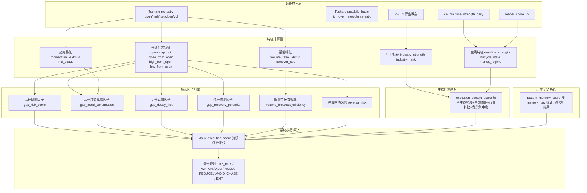
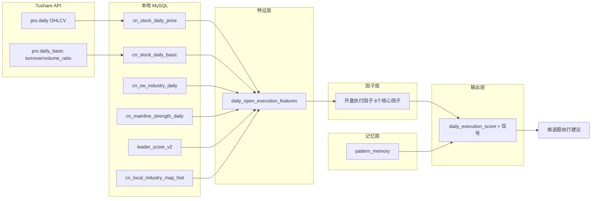

# D_DAILY_OPEN_EXECUTION_LAYER
## GrowthAlpha V8 — 日级开盘执行过滤层 系统设计文档

---

## 目录

1. [系统定位与边界](#1-系统定位与边界)
2. [整体架构](#2-整体架构)
3. [数据层：daily_open_execution_features](#3-数据层daily_open_execution_features)
4. [核心因子设计](#4-核心因子设计)
5. [主线环境融合](#5-主线环境融合)
6. [历史记忆系统](#6-历史记忆系统)
7. [最终执行评分](#7-最终执行评分)
8. [数据流与每日运行流程](#8-数据流与每日运行流程)
9. [推荐数据库结构](#9-推荐数据库结构)
10. [推荐回测方法](#10-推荐回测方法)
11. [MVP 最小可落地版本](#11-mvp-最小可落地版本)
12. [因子失效分析与优先级](#12-因子失效分析与优先级)

---

## 1. 系统定位与边界

### 1.1 核心定位

```
D_DAILY_OPEN_EXECUTION_LAYER 不回答"买什么"。
它只回答"今天，对候选股，是否值得执行"。
```

本层是 GrowthAlpha V8 的 **执行过滤层**，位于选股系统之后、交易执行之前。

### 1.2 输入 / 输出

| 方向 | 内容 | 来源 |
|------|------|------|
| **输入** | 候选股列表（A-line / B-line 选出） | GrowthAlpha V8 选股层 |
| **输入** | 个股日线行情 + daily_basic | Tushare pro.daily / pro.daily_basic |
| **输入** | 行业映射 + 行业日线 | SW L1 行业 + 自建行业强度 |
| **输入** | 主线强度 + 生命周期 | cn_mainline_strength_daily |
| **输入** | 龙头评分 | leader_score_v2 |
| **输出** | 每只候选股的执行信号 | TRY_BUY / WATCH / ADD / HOLD / REDUCE / AVOID_CHASE / EXIT |

### 1.3 严格不做什么

| 不做 | 原因 |
|------|------|
| 选股 | 这是 A-line / B-line 的职责 |
| 预测明天收盘 | 低频系统不预测，只评估当前执行条件 |
| 短线打板 / 超短情绪 | 日级数据不支持，也不适配低频策略 |
| Level2 / Tick / 分钟 | 数据限制禁止使用 |
| 实时盘口 | 非本层范围 |

### 1.4 设计原则

```
1. 每个因子必须有明确的 A 股行为学逻辑支撑
2. 每个因子必须可回溯（仅用日级数据）
3. 每个因子必须可解释（不依赖黑箱）
4. 评分必须考虑主线环境上下文
5. 必须内置过拟合防护
```

---

## 2. 整体架构



### 2.1 分层职责

| 层 | 职责 | 技术实现 |
|----|------|----------|
| **数据层** | 从 Tushare 拉取日线 + daily_basic，计算基础特征 | Python + SQL ETL |
| **因子层** | 基于基础特征计算 6 个核心开盘执行因子 | Python pandas/numpy |
| **上下文层** | 融合主线环境、生命周期、行业扩散 | Python + SQL 查询 |
| **记忆层** | 按 pattern 聚类统计历史执行结果 | Python + MySQL 存储 |
| **评分层** | 加权综合评分 + 信号映射 | Python 规则引擎 |

---

## 3. 数据层：daily_open_execution_features

### 3.1 表结构

```sql
CREATE TABLE IF NOT EXISTS `daily_open_execution_features` (
    -- 主键
    `symbol`        VARCHAR(10)  NOT NULL COMMENT '股票代码',
    `trade_date`    DATE         NOT NULL COMMENT '交易日',

    -- ========== 开盘缺口 ==========
    `open_gap_pct`      DECIMAL(18,6) DEFAULT NULL COMMENT '开盘缺口百分比 (open - pre_close) / pre_close',
    `close_from_open`   DECIMAL(18,6) DEFAULT NULL COMMENT '收盘相对开盘涨跌幅 (close - open) / open',
    `high_from_open`    DECIMAL(18,6) DEFAULT NULL COMMENT '日内最高相对开盘 (high - open) / open',
    `low_from_open`     DECIMAL(18,6) DEFAULT NULL COMMENT '日内最低相对开盘 (low - open) / open',
    `open_position`     DECIMAL(18,6) DEFAULT NULL COMMENT '开盘在当日区间的位置 (open - low) / (high - low)',

    -- ========== 量能 ==========
    `volume_ratio_5d`   DECIMAL(18,6) DEFAULT NULL COMMENT '当日成交量 / 5日均量',
    `volume_ratio_20d`  DECIMAL(18,6) DEFAULT NULL COMMENT '当日成交量 / 20日均量',
    `turnover_rate`     DECIMAL(18,6) DEFAULT NULL COMMENT '换手率 (来自 daily_basic)',

    -- ========== 趋势动量 ==========
    `momentum_20d`      DECIMAL(18,6) DEFAULT NULL COMMENT '20日动量 (close / close_20d_ago - 1)',
    `momentum_60d`      DECIMAL(18,6) DEFAULT NULL COMMENT '60日动量 (close / close_60d_ago - 1)',
    `ma5`               DECIMAL(18,4) DEFAULT NULL COMMENT '5日均价',
    `ma20`              DECIMAL(18,4) DEFAULT NULL COMMENT '20日均价',
    `ma60`              DECIMAL(18,4) DEFAULT NULL COMMENT '60日均价',
    `ma_status`         VARCHAR(16)   DEFAULT NULL COMMENT '均线状态: BULLISH / NEUTRAL / BEARISH',

    -- ========== 行业 ==========
    `industry_id`       VARCHAR(32)   DEFAULT NULL COMMENT 'SW L1 行业代码',
    `industry_name`     VARCHAR(80)   DEFAULT NULL COMMENT 'SW L1 行业名称',
    `industry_strength` DECIMAL(18,6) DEFAULT NULL COMMENT '行业强度 (行业20日涨幅在全市场的百分位)',
    `industry_rank`     INT           DEFAULT NULL COMMENT '行业在全市场中的排名',

    -- ========== 主线 ==========
    `mainline_name`         VARCHAR(128) DEFAULT NULL COMMENT '所属主线名称',
    `mainline_strength`     DECIMAL(18,6) DEFAULT NULL COMMENT '主线强度评分',
    `mainline_lifecycle`    VARCHAR(24)   DEFAULT NULL COMMENT '主线生命周期: IGNITE / EXPAND / CONFIRM / FADE',
    `mainline_trend_days`   INT           DEFAULT NULL COMMENT '主线持续天数',

    -- ========== 龙头 ==========
    `leader_bucket`     VARCHAR(16) DEFAULT NULL COMMENT '龙头分类: CORE_LEADER / NEAR_LEADER / EDGE_LEADER / NON_LEADER',
    `leader_score`      INT         DEFAULT NULL COMMENT '龙头评分 (0-3)',

    -- ========== 市场状态 ==========
    `market_regime`     VARCHAR(16) DEFAULT NULL COMMENT '市场状态: TREND_UP / TREND_DOWN / RANGE / VOLATILE',

    -- ========== 执行结果（用于回测/记忆系统） ==========
    `execution_outcome` VARCHAR(16) DEFAULT NULL COMMENT '执行结果标签: PROFIT / LOSS / STOPPED / FLAT',
    `forward_1d_return` DECIMAL(18,6) DEFAULT NULL COMMENT '次日收盘收益 (next_close - close) / close',
    `forward_5d_return` DECIMAL(18,6) DEFAULT NULL COMMENT '5日后收盘收益',
    `forward_1d_max_dd` DECIMAL(18,6) DEFAULT NULL COMMENT '次日最大回撤',

    -- ========== 元数据 ==========
    `source`        VARCHAR(32) DEFAULT 'tushare',
    `created_at`    TIMESTAMP NULL DEFAULT CURRENT_TIMESTAMP,
    `updated_at`    TIMESTAMP NULL DEFAULT CURRENT_TIMESTAMP ON UPDATE CURRENT_TIMESTAMP,

    PRIMARY KEY (`symbol`, `trade_date`),

    -- 索引
    KEY `idx_doef_trade_date` (`trade_date`),
    KEY `idx_doef_industry_date` (`industry_id`, `trade_date`),
    KEY `idx_doef_mainline_date` (`mainline_name`, `trade_date`),
    KEY `idx_doef_gap` (`trade_date`, `open_gap_pct`),
    KEY `idx_doef_momentum` (`trade_date`, `momentum_20d`),
    KEY `idx_doef_leader` (`trade_date`, `leader_bucket`)
) ENGINE=InnoDB DEFAULT CHARSET=utf8mb4 COLLATE=utf8mb4_general_ci;
```

### 3.2 字段说明

#### 开盘缺口类

| 字段 | 公式 | 含义 |
|------|------|------|
| `open_gap_pct` | `(open - pre_close) / pre_close` | 开盘相对昨收的涨跌幅。>0.03 为高开，<-0.03 为低开 |
| `close_from_open` | `(close - open) / open` | 收盘相对开盘的涨跌幅。正值为开盘后走强，负值为开盘后走弱 |
| `high_from_open` | `(high - open) / open` | 日内最高相对开盘。衡量开盘后上冲力度 |
| `low_from_open` | `(low - open) / open` | 日内最低相对开盘。衡量开盘后下探深度 |
| `open_position` | `(open - low) / (high - low)` | 开盘在当日区间的位置。>0.7 为高位开盘，<0.3 为低位开盘 |

#### 量能类

| 字段 | 来源 | 含义 |
|------|------|------|
| `volume_ratio_5d` | 计算 | 当日成交量 / 5日均量。>1.5 为显著放量 |
| `volume_ratio_20d` | 计算 | 当日成交量 / 20日均量。>1.5 为显著放量 |
| `turnover_rate` | daily_basic | 换手率。>10% 为高换手 |

#### 趋势类

| 字段 | 公式 | 含义 |
|------|------|------|
| `momentum_20d` | `close / close_20d_ago - 1` | 20日涨幅 |
| `momentum_60d` | `close / close_60d_ago - 1` | 60日涨幅 |
| `ma_status` | 见下方 | 均线排列状态 |

`ma_status` 判定逻辑：

```
if close > ma20 > ma60:  BULLISH     (多头排列)
if close < ma20 < ma60:  BEARISH     (空头排列)
else:                    NEUTRAL     (震荡/交叉)
```

---

## 4. 核心因子设计

### 4.1 因子总览

| # | 因子名 | 缩写 | 衡量目标 | 取值范围 |
|---|--------|------|----------|----------|
| 1 | 高开风险 | `gap_risk_score` | 高开后接盘概率 | 0-100 |
| 2 | 高开趋势延续 | `gap_trend_continuation` | 高开后趋势延续概率 | 0-100 |
| 3 | 高开衰减 | `gap_decay_risk` | 高开后冲高回落概率 | 0-100 |
| 4 | 低开修复 | `gap_recovery_potential` | 低开后修复概率 | 0-100 |
| 5 | 放量突破有效率 | `volume_breakout_efficiency` | 放量突破的可持续性 | 0-100 |
| 6 | 冲高回落风险 | `reversal_risk` | 日内冲高回落概率 | 0-100 |

---

### 4.2 因子 1：高开风险因子 `gap_risk_score`

#### 数学定义

```
gap_risk_score = 
    w1 * (open_gap_pct > threshold_high) * 40
    + w2 * (turnover_rate > threshold_turnover) * 30
    + w3 * (momentum_20d > threshold_momentum) * 20
    + w4 * (leader_bucket == 'NON_LEADER') * 10
```

其中：
- `threshold_high` = 0.05（高开超过 5%）
- `threshold_turnover` = 0.08（换手率超过 8%）
- `threshold_momentum` = 0.30（20 日涨幅超过 30%）
- `w1` = 1.0, `w2` = 1.0, `w3` = 1.0, `w4` = 1.0

#### 为什么有效

A 股 T+1 机制下，**高开 + 高换手 + 高位** 是典型的接盘信号组合：

1. **高开 > 5%**：非龙头股的高开往往由隔夜情绪驱动，而非内生买盘
2. **换手率 > 8%**：高换手意味着大量筹码交换，若不能封板则次日抛压巨大
3. **20 日涨幅 > 30%**：已经积累了大量获利盘，高开更容易引发兑现
4. **非龙头**：非龙头股缺乏抱团资金承接，高开更容易回落

#### A 股适用逻辑

```
在 A 股 T+1 环境下：
- 高开买入 = 当日无法卖出
- 如果高开后回落，当日即产生浮亏
- 次日低开概率增加（统计上高开次日低开概率 > 55%）
- 因此高开风险因子是 T+1 保护的第一道防线
```

---

### 4.3 因子 2：高开趋势延续因子 `gap_trend_continuation`

#### 数学定义

```
gap_trend_continuation = 
    + 30 * (ma_status == 'BULLISH')
    + 25 * (leader_bucket IN ('CORE_LEADER', 'NEAR_LEADER'))
    + 20 * (mainline_lifecycle IN ('IGNITE', 'EXPAND'))
    + 15 * (volume_ratio_5d BETWEEN 1.0 AND 2.0)
    + 10 * (industry_strength > 0.7)
```

取值范围：0-100

#### 为什么有效

A 股龙头抱团效应下：

1. **多头排列 + 龙头**：趋势龙头的高开更可能是趋势加速而非诱多
2. **主线 IGNITE/EXPAND 阶段**：主线扩散期的高开有后续资金接力
3. **温和放量（1-2 倍）**：放量但不过度，说明有新增资金但未到高潮
4. **行业强势**：行业整体强势提供板块支撑

#### 与 gap_risk_score 的关系

```
gap_risk_score 和 gap_trend_continuation 不是互斥的。
它们从不同角度评估同一现象：

- 高开风险：衡量"接盘"概率
- 高开延续：衡量"趋势加速"概率

最终评分中，两者共同决定对高开的态度：
- 高延续 + 低风险 = TRY_BUY / ADD
- 低延续 + 高风险 = AVOID_CHASE
- 高延续 + 高风险 = REDUCE（减仓）
```

---

### 4.4 因子 3：高开衰减因子 `gap_decay_risk`

#### 数学定义

```
gap_decay_risk = 
    + 35 * (close_from_open < -0.02)           -- 开盘后走弱
    + 25 * (high_from_open - close_from_open > 0.03)  -- 冲高回落幅度大
    + 20 * (mainline_lifecycle == 'FADE')       -- 主线退潮
    + 20 * (leader_bucket == 'EDGE_LEADER')     -- 边缘龙头
```

取值范围：0-100

#### 为什么有效

```
高开衰减 = 开盘后价格行为已经显示弱势。

核心逻辑：
1. close_from_open < -0.02：开盘后价格持续走低，说明开盘价是日内高点
2. 冲高回落幅度大：说明上方抛压沉重
3. 主线退潮：板块整体资金流出，个股难以独善其身
4. 边缘龙头：缺乏核心资金抱团，更容易被抛弃
```

---

### 4.5 因子 4：低开修复因子 `gap_recovery_potential`

#### 数学定义

```
gap_recovery_potential = 
    + 30 * (ma_status == 'BULLISH')
    + 25 * (leader_bucket IN ('CORE_LEADER', 'NEAR_LEADER'))
    + 20 * (mainline_lifecycle IN ('IGNITE', 'EXPAND', 'CONFIRM'))
    + 15 * (volume_ratio_5d < 0.8)              -- 缩量低开
    + 10 * (open_gap_pct > -0.05)               -- 低开幅度不大
```

取值范围：0-100

#### 为什么有效

```
A 股趋势股的低开往往是洗盘而非出货，前提是：

1. 多头排列：趋势未破坏
2. 龙头股：有资金维护
3. 主线未退潮：板块仍在
4. 缩量低开：非恐慌性抛售
5. 低开幅度 < 5%：非系统性风险

当 recovery_potential > 60 时，低开是加仓机会而非恐慌理由。
```

---

### 4.6 因子 5：放量突破有效率 `volume_breakout_efficiency`

#### 数学定义

```
volume_breakout_efficiency = 
    + 30 * (close_from_open > 0.02)             -- 放量后站稳
    + 25 * (volume_ratio_5d BETWEEN 1.2 AND 2.5) -- 有效放量区间
    + 20 * (ma_status == 'BULLISH')
    + 15 * (industry_strength > 0.6)
    + 10 * (leader_bucket IN ('CORE_LEADER', 'NEAR_LEADER'))
```

取值范围：0-100

#### 为什么有效

```
放量突破的有效性取决于：

1. 放量后能否站稳（close_from_open > 0）：真正的突破需要收盘确认
2. 放量倍数 1.2-2.5 倍：放量不足则突破无力，放量过大则可能是出货
3. 多头排列 + 行业强势：突破的宏观环境支持
4. 龙头股：突破的微观基础

放量突破有效率用于区分：
- 有效突破（efficiency > 60）：可追涨
- 假突破（efficiency < 40）：应等待
```

---

### 4.7 因子 6：冲高回落风险 `reversal_risk`

#### 数学定义

```
reversal_risk = 
    + 30 * (high_from_open > 0.05 AND close_from_open < 0.01)  -- 冲高但收盘近平
    + 25 * (volume_ratio_5d > 2.5)                              -- 天量
    + 20 * (mainline_lifecycle == 'FADE')                       -- 主线退潮
    + 15 * (leader_bucket == 'EDGE_LEADER')                     -- 边缘龙头
    + 10 * (momentum_60d > 0.50)                                -- 累计涨幅过大
```

取值范围：0-100

#### 为什么有效

```
冲高回落是 A 股最常见的日内陷阱：

1. 冲高但收盘近平：说明日内追高资金被套
2. 天量：可能是主力出货
3. 主线退潮 + 边缘龙头：最危险的组合
4. 累计涨幅过大：获利盘兑现压力

当 reversal_risk > 60 时，当日冲高应减仓而非加仓。
```

---

## 5. 主线环境融合

### 5.1 为什么需要主线环境融合

```
同样一个"高开 + 放量"信号：

在 TREND_EXPANSION 环境中：
- 主线正在扩散
- 资金从龙头向板块内扩散
- 高开放量 = 资金扩散的信号
- 结论：加仓机会

在 TOP_DECAY 环境中：
- 主线已经高潮
- 龙头开始滞涨
- 高开放量 = 最后一棒
- 结论：接盘风险
```

### 5.2 execution_context_score

#### 定义

```python
execution_context_score = 
    + 30 * mainline_phase_score      # 主线阶段评分
    + 25 * lifecycle_alignment       # 生命周期对齐度
    + 25 * industry_diffusion        # 行业扩散程度
    + 20 * leader_concentration      # 龙头集中度
```

取值范围：0-100

#### 5.2.1 mainline_phase_score

| 主线生命周期 | 评分 | 含义 |
|-------------|------|------|
| IGNITE | 80 | 主线刚启动，高开是确认信号 |
| EXPAND | 90 | 主线扩散期，高开是扩散信号 |
| CONFIRM | 60 | 主线确认期，高开需谨慎 |
| FADE | 20 | 主线退潮期，高开是出货信号 |
| NEUTRAL | 40 | 无主线状态，高开随机性大 |

#### 5.2.2 lifecycle_alignment

衡量个股生命周期与主线生命周期的对齐程度：

```
lifecycle_alignment = 
    if 个股趋势状态 == 主线阶段对应的理想状态:
        100
    elif 个股趋势状态 == 主线阶段对应的次优状态:
        50
    else:
        0
```

| 主线阶段 | 理想个股状态 | 次优个股状态 |
|----------|-------------|-------------|
| IGNITE | 刚突破 / 放量启动 | 横盘整理 |
| EXPAND | 趋势加速 / 放量突破 | 温和上涨 |
| CONFIRM | 趋势延续 / 缩量上涨 | 高位震荡 |
| FADE | 已减仓 / 轻仓 | 反弹 |

#### 5.2.3 industry_diffusion

衡量行业内部扩散程度：

```
industry_diffusion = 
    (行业内部上涨家数 / 行业总家数) * 50
    + (行业内部涨停家数 / 行业总家数) * 50
```

- 高扩散（>70）：行业整体强势，个股高开更安全
- 低扩散（<30）：行业分化严重，个股高开风险大

#### 5.2.4 leader_concentration

衡量龙头集中度：

```
leader_concentration = 
    top3 成交额占比 * 100
```

- 高集中度（>60%）：资金集中在少数龙头，跟风股风险大
- 低集中度（<30%）：资金分散，板块普涨

---

## 6. 历史记忆系统

### 6.1 设计目标

```
系统学习"某类开盘行为"在历史中的结果分布。

例如：
"高开 + 主线行业 + 龙头 + 趋势市场"
历史上：
- 上涨概率 72%
- 平均收益 +3.2%
- 平均最大回撤 -1.8%
```

### 6.2 pattern_memory 表结构

```sql
CREATE TABLE IF NOT EXISTS `pattern_memory` (
    `memory_key`        VARCHAR(128) NOT NULL COMMENT '模式唯一标识',
    `trade_date`        DATE NOT NULL COMMENT '最新统计日期',

    -- 模式描述
    `gap_bucket`        VARCHAR(16) NOT NULL COMMENT '开盘缺口分类: HIGH_OPEN / LOW_OPEN / FLAT',
    `trend_bucket`      VARCHAR(16) NOT NULL COMMENT '趋势分类: BULLISH / BEARISH / RANGE',
    `mainline_bucket`   VARCHAR(16) NOT NULL COMMENT '主线阶段: IGNITE / EXPAND / CONFIRM / FADE / NONE',
    `leader_bucket`     VARCHAR(16) NOT NULL COMMENT '龙头分类: CORE / NEAR / EDGE / NONE',
    `volume_bucket`     VARCHAR(16) NOT NULL COMMENT '量能分类: HIGH_VOL / NORMAL_VOL / LOW_VOL',

    -- 统计结果
    `sample_count`      INT NOT NULL DEFAULT 0 COMMENT '历史样本数',
    `win_count`         INT NOT NULL DEFAULT 0 COMMENT '盈利次数',
    `loss_count`        INT NOT NULL DEFAULT 0 COMMENT '亏损次数',
    `win_rate`          DECIMAL(10,6) DEFAULT NULL COMMENT '胜率 win_count / sample_count',
    `avg_return`        DECIMAL(18,8) DEFAULT NULL COMMENT '平均收益 (forward_1d_return 均值)',
    `avg_mdd`           DECIMAL(18,8) DEFAULT NULL COMMENT '平均最大回撤 (forward_1d_max_dd 均值)',
    `profit_factor`     DECIMAL(18,8) DEFAULT NULL COMMENT '盈亏比',
    `sharpe_approx`     DECIMAL(18,8) DEFAULT NULL COMMENT '近似夏普 (avg_return / std_return)',

    -- 置信度
    `confidence_score`  DECIMAL(10,6) DEFAULT NULL COMMENT '置信度评分 0-1',
    `std_return`        DECIMAL(18,8) DEFAULT NULL COMMENT '收益标准差',
    `max_win`           DECIMAL(18,8) DEFAULT NULL COMMENT '最大单次收益',
    `max_loss`          DECIMAL(18,8) DEFAULT NULL COMMENT '最大单次亏损',

    -- 元数据
    `updated_at` TIMESTAMP NULL DEFAULT CURRENT_TIMESTAMP ON UPDATE CURRENT_TIMESTAMP,

    PRIMARY KEY (`memory_key`),
    KEY `idx_pattern_memory_date` (`trade_date`),
    KEY `idx_pattern_memory_gap` (`gap_bucket`, `mainline_bucket`, `leader_bucket`),
    KEY `idx_pattern_memory_confidence` (`confidence_score` DESC)
) ENGINE=InnoDB DEFAULT CHARSET=utf8mb4 COLLATE=utf8mb4_general_ci;
```

### 6.3 memory_key 生成规则

```
memory_key = f"{gap_bucket}|{trend_bucket}|{mainline_bucket}|{leader_bucket}|{volume_bucket}"
```

示例：
```
"HIGH_OPEN|BULLISH|EXPAND|CORE|HIGH_VOL"
"LOW_OPEN|BULLISH|CONFIRM|NEAR|NORMAL_VOL"
"FLAT|RANGE|NONE|NONE|LOW_VOL"
```

### 6.4 分桶规则

| 维度 | 桶 | 条件 |
|------|----|------|
| `gap_bucket` | HIGH_OPEN | open_gap_pct > 0.03 |
| | LOW_OPEN | open_gap_pct < -0.02 |
| | FLAT | 其余 |
| `trend_bucket` | BULLISH | ma_status == 'BULLISH' |
| | BEARISH | ma_status == 'BEARISH' |
| | RANGE | 其余 |
| `mainline_bucket` | IGNITE/EXPAND/CONFIRM/FADE | 对应 lifecycle_state |
| | NONE | 无主线 |
| `leader_bucket` | CORE/NEAR/EDGE | 对应 leader_bucket |
| | NONE | NON_LEADER |
| `volume_bucket` | HIGH_VOL | volume_ratio_5d > 1.5 |
| | NORMAL_VOL | 0.7 <= volume_ratio_5d <= 1.5 |
| | LOW_VOL | volume_ratio_5d < 0.7 |

### 6.5 置信度评分

```python
def compute_confidence(sample_count: int, win_rate: float, std_return: float) -> float:
    """
    置信度评分 0-1

    考虑因素：
    1. 样本量：样本越多越可信
    2. 胜率稳定性：胜率偏离 0.5 越远越可信
    3. 收益波动：波动越小越可信
    """
    # 样本量因子（使用对数缩放）
    n_factor = min(1.0, np.log10(sample_count + 1) / 3.0)  # 1000样本时 ~1.0

    # 胜率偏离因子
    wr_deviation = abs(win_rate - 0.5) * 2  # 0.5->0, 1.0->1.0

    # 波动惩罚
    vol_penalty = 1.0 / (1.0 + std_return * 10) if std_return > 0 else 1.0

    return n_factor * (0.6 * wr_deviation + 0.4 * vol_penalty)
```

### 6.6 过拟合防护

| 防护措施 | 实现方式 |
|----------|----------|
| **最小样本量** | sample_count < 20 时 confidence_score = 0 |
| **时间衰减** | 超过 6 个月的样本权重减半 |
| **分桶粗粒度** | 仅 5 个维度各 3-5 个桶，避免维度爆炸 |
| **正则化** | 使用贝叶斯平均：`adjusted_win_rate = (win_count + 5) / (sample_count + 10)` |
| **交叉验证** | 按年份滚动验证，避免过拟合到特定年份 |
| **拒绝偶然** | 连续 3 次以上同向结果才更新 confidence_score |

---

## 7. 最终执行评分

### 7.1 评分公式

```python
daily_execution_score = 
    0.25 * open_strength          # 开盘强度综合
    + 0.25 * mainline_score       # 主线环境评分
    + 0.20 * lifecycle_score      # 生命周期评分
    + 0.15 * momentum_score       # 动量评分
    + 0.10 * memory_score         # 历史记忆评分
    + 0.05 * risk_penalty         # 风险惩罚项（负值）
```

### 7.2 各分量定义

#### 7.2.1 open_strength (0-100)

```python
open_strength = 
    + gap_trend_continuation      # 高开延续性
    - gap_risk_score              # 高开风险（负向）
    + gap_recovery_potential      # 低开修复
    - reversal_risk               # 冲高回落风险（负向）
```

归一化到 0-100 范围。

#### 7.2.2 mainline_score (0-100)

```python
mainline_score = execution_context_score  # 直接使用主线环境融合评分
```

#### 7.2.3 lifecycle_score (0-100)

```python
lifecycle_score = 
    if mainline_lifecycle == 'IGNITE':  80
    elif mainline_lifecycle == 'EXPAND': 90
    elif mainline_lifecycle == 'CONFIRM': 50
    elif mainline_lifecycle == 'FADE':   20
    else: 40
```

#### 7.2.4 momentum_score (0-100)

```python
momentum_score = 
    + 40 * (momentum_20d > 0 AND momentum_20d < 0.30)  # 温和上涨
    + 30 * (ma_status == 'BULLISH')
    + 30 * (momentum_60d > momentum_20d)                # 动量加速
```

#### 7.2.5 memory_score (0-100)

```python
memory_score = 
    if confidence_score > 0.5:
        win_rate * 100 * confidence_score  # 高置信度时使用历史胜率
    else:
        50  # 低置信度时回归到中性
```

#### 7.2.6 risk_penalty (-50 to 0)

```python
risk_penalty = 
    - 20 * (gap_risk_score > 60)          # 高风险开盘
    - 15 * (reversal_risk > 60)           # 高冲高回落风险
    - 10 * (mainline_lifecycle == 'FADE') # 主线退潮
    - 5  * (leader_bucket == 'NON_LEADER' AND open_gap_pct > 0.05)  # 非龙头高开
```

### 7.3 信号映射

| 评分区间 | 信号 | 含义 | 操作建议 |
|----------|------|------|----------|
| >= 80 | **TRY_BUY** | 强烈建议执行 | 可开新仓 / 加仓 |
| 65-79 | **ADD** | 适合加仓 | 现有持仓可加仓 |
| 50-64 | **HOLD** | 适合持有 | 持仓不动，不加减仓 |
| 35-49 | **WATCH** | 观察等待 | 不操作，继续观察 |
| 20-34 | **REDUCE** | 建议减仓 | 现有持仓减仓 |
| 10-19 | **AVOID_CHASE** | 禁止追涨 | 即使选股层推荐，也禁止执行 |
| < 10 | **EXIT** | 建议清仓 | 强制退出 |

### 7.4 如何避免常见陷阱

#### 7.4.1 避免追在顶部

触发条件：
- daily_execution_score < 30
- 且 gap_risk_score > 60
- 且 reversal_risk > 50

应对：
- 强制输出 AVOID_CHASE
- 即使选股层强烈推荐，执行层也必须拦截

#### 7.4.2 避免情绪高潮接盘

触发条件：
- mainline_lifecycle == 'CONFIRM' 且持续 > 20 天
- 且 leader_concentration > 70%
- 且 volume_ratio_5d > 2.0

应对：
- 降低 mainline_score 权重至 0.5x
- 提高 risk_penalty 至 2x

#### 7.4.3 避免主线退潮误判

触发条件：
- mainline_lifecycle == 'FADE'
- 但个股 ma_status == 'BULLISH'
- 且个股 momentum_20d > 0

应对：
- 不直接 EXIT
- 输出 REDUCE（减仓而非清仓）
- 等待个股趋势确认破坏后再 EXIT

#### 7.4.4 避免龙头末期加仓

触发条件：
- leader_bucket == 'CORE_LEADER'
- 但 mainline_lifecycle == 'FADE'
- 且 momentum_60d > 0.80（累计涨幅过大）

应对：
- 即使评分 > 65，也只输出 HOLD 而非 ADD
- 禁止在龙头末期加仓

---

## 8. 数据流与每日运行流程

### 8.1 数据流图



### 8.2 每日运行流程

每日收盘后（或次日开盘前）执行：

**Step 1: 数据准备 (17:00-18:00)**
- 拉取当日 pro.daily（所有 A 股）
- 拉取当日 pro.daily_basic
- 拉取当日 SW 行业日线
- 写入本地 MySQL

**Step 2: 特征计算 (18:00-18:30)**
- 计算 daily_open_execution_features
  - 开盘缺口特征
  - 量能特征
  - 趋势动量特征
  - 行业特征（关联 SW 行业）
  - 主线特征（关联 cn_mainline_strength_daily）
- 写入 daily_open_execution_features 表

**Step 3: 因子计算 (18:30-19:00)**
- 计算 6 个核心因子
  - gap_risk_score
  - gap_trend_continuation
  - gap_decay_risk
  - gap_recovery_potential
  - volume_breakout_efficiency
  - reversal_risk
- 计算 execution_context_score
- 写入因子结果（可存为视图或临时表）

**Step 4: 记忆更新 (19:00-19:15)**
- 读取今日 forward_1d_return（T+1 回填）
- 更新 pattern_memory 统计
- 计算 confidence_score

**Step 5: 执行评分 (开盘前 09:00-09:15)**
- 读取候选股列表（来自 A-line / B-line）
- 对每只候选股计算 daily_execution_score
- 映射为执行信号
- 输出执行建议表

**Step 6: 结果输出 (09:15)**
- 生成 daily_execution_signal 表
- 输出到交易系统
- 归档日志

### 8.3 增量更新策略

对于历史数据回填：
- 使用 chunk 机制（与现有 cn_mainline_strength_daily 一致）
- 按月分块，支持断点续传
- 回填时同时计算 forward_1d_return 用于记忆系统

对于每日增量：
- 仅处理最新交易日
- 使用 trade_date = (SELECT MAX(trade_date) FROM cn_stock_daily_price)
- 增量更新 pattern_memory

---

## 9. 推荐数据库结构

### 9.1 完整 DDL 清单

| 表名 | 类型 | 用途 | 依赖 |
|------|------|------|------|
| daily_open_execution_features | 事实表 | 存储每日开盘执行特征 | cn_stock_daily_price, cn_stock_daily_basic, cn_sw_industry_daily, cn_mainline_strength_daily |
| pattern_memory | 统计表 | 存储历史模式统计 | daily_open_execution_features |
| daily_execution_signal | 结果表 | 存储每日执行信号 | daily_open_execution_features + 因子计算 |

### 9.2 daily_execution_signal 表

```sql
CREATE TABLE IF NOT EXISTS `daily_execution_signal` (
    `trade_date`    DATE        NOT NULL COMMENT '交易日',
    `symbol`        VARCHAR(10) NOT NULL COMMENT '股票代码',
    `source_system` VARCHAR(16) NOT NULL COMMENT '来源系统: A_LINE / B_LINE',

    -- 评分分量
    `open_strength`         DECIMAL(10,4) DEFAULT NULL COMMENT '开盘强度评分 0-100',
    `mainline_score`        DECIMAL(10,4) DEFAULT NULL COMMENT '主线环境评分 0-100',
    `lifecycle_score`       DECIMAL(10,4) DEFAULT NULL COMMENT '生命周期评分 0-100',
    `momentum_score`        DECIMAL(10,4) DEFAULT NULL COMMENT '动量评分 0-100',
    `memory_score`          DECIMAL(10,4) DEFAULT NULL COMMENT '记忆评分 0-100',
    `risk_penalty`          DECIMAL(10,4) DEFAULT NULL COMMENT '风险惩罚 -50-0',

    -- 核心因子
    `gap_risk_score`                DECIMAL(10,4) DEFAULT NULL,
    `gap_trend_continuation`        DECIMAL(10,4) DEFAULT NULL,
    `gap_decay_risk`                DECIMAL(10,4) DEFAULT NULL,
    `gap_recovery_potential`        DECIMAL(10,4) DEFAULT NULL,
    `volume_breakout_efficiency`    DECIMAL(10,4) DEFAULT NULL,
    `reversal_risk`                 DECIMAL(10,4) DEFAULT NULL,
    `execution_context_score`       DECIMAL(10,4) DEFAULT NULL,

    -- 最终评分与信号
    `daily_execution_score` DECIMAL(10,4) DEFAULT NULL COMMENT '最终执行评分 0-100',
    `execution_signal`      VARCHAR(16)   DEFAULT NULL COMMENT '执行信号',

    -- 元数据
    `created_at` TIMESTAMP NULL DEFAULT CURRENT_TIMESTAMP,

    PRIMARY KEY (`trade_date`, `symbol`, `source_system`),
    KEY `idx_des_signal` (`trade_date`, `execution_signal`),
    KEY `idx_des_score` (`trade_date`, `daily_execution_score` DESC)
) ENGINE=InnoDB DEFAULT CHARSET=utf8mb4 COLLATE=utf8mb4_general_ci;
```

---

## 10. 推荐回测方法

### 10.1 回测框架设计

```python
class DailyExecutionBacktest:
    """
    回测 D_DAILY_OPEN_EXECUTION_LAYER 的执行信号有效性。

    核心问题：
    1. TRY_BUY 信号后，次日/5日后收益是否显著为正？
    2. AVOID_CHASE 信号后，是否避免了亏损？
    3. EXIT 信号后，是否避免了更大回撤？
    """

    def __init__(self, start_date, end_date):
        self.start_date = start_date
        self.end_date = end_date

    def load_data(self):
        """加载 daily_open_execution_features + forward_return"""
        pass

    def compute_signals(self):
        """计算历史每日的执行信号"""
        pass

    def evaluate_signal(self, signal: str):
        """
        评估特定信号的表现：
        - TRY_BUY: 计算 signal -> forward_1d_return 分布
        - AVOID_CHASE: 计算 signal -> 次日是否下跌
        - EXIT: 计算 signal -> 后续 5 日是否继续下跌
        """
        pass

    def confusion_matrix(self):
        """
        构建混淆矩阵：

                        实际涨  实际跌
        建议买             TP     FP
        建议不买/卖        FN     TN

        计算：
        - 准确率
        - 精确率（避免误伤）
        - 召回率（捕捉机会）
        - F1 分数
        """
        pass

    def walk_forward_validation(self, n_splits=5):
        """
        滚动时间序列交叉验证：
        - 按年分割：train 2018-2022, test 2023
        - train 2020-2023, test 2024
        - 检查评分权重在不同年份的稳定性
        """
        pass
```

### 10.2 回测指标

| 指标 | 计算方式 | 含义 |
|------|----------|------|
| 信号准确率 | 正确信号数 / 总信号数 | 信号的整体准确性 |
| 信号精确率 | TP / (TP + FP) | 买入信号中真正上涨的比例 |
| 信号召回率 | TP / (TP + FN) | 上涨股票中被正确识别的比例 |
| 信号 F1 | 2 * P * R / (P + R) | 精确率和召回率的调和平均 |
| 避免亏损率 | AVOID_CHASE 后下跌比例 | 风险信号的保护效果 |
| 信号收益差 | 执行信号 vs 反向信号收益差 | 信号的信息系数 |
| IC（信息系数） | daily_execution_score 与 forward_1d_return 的秩相关 | 评分的预测能力 |

### 10.3 回测注意事项

1. 避免前视偏差：
   - forward_1d_return 必须在 T+1 日收盘后才知道
   - 回测时必须使用 T 日收盘时的数据计算评分
   - 不能使用 T+1 日的数据

2. 样本外验证：
   - 必须保留最近 1 年数据作为样本外
   - 权重优化只能在样本内进行

3. 分组回测：
   - 按评分分组（0-20, 20-40, 40-60, 60-80, 80-100）
   - 检查分组收益是否单调递增
   - 如果分组收益不单调，说明评分结构有问题

4. 特殊时期测试：
   - 牛市（2019-2020）
   - 熊市（2018, 2022）
   - 震荡市（2023-2024）
   - 检查信号在不同市场环境下的稳定性

---

## 11. MVP 最小可落地版本

### 11.1 MVP 范围

MVP 目标：在 2 周内实现可运行的执行过滤层

包含：
- daily_open_execution_features 表 + ETL
- 6 个核心因子（简化版）
- execution_context_score（基础版）
- daily_execution_score + 信号输出
- 每日增量运行脚本

不包含（后续迭代）：
- pattern_memory 系统
- 完整回测框架
- 权重自动优化
- 多系统融合（A-line + B-line）

### 11.2 MVP 实现步骤

| 步骤 | 内容 | 预计工作量 |
|------|------|-----------|
| Step 1 | 创建 daily_open_execution_features 表 DDL | 0.5 天 |
| Step 2 | 实现特征计算 ETL（Python + SQL） | 2 天 |
| Step 3 | 实现 6 个核心因子计算 | 2 天 |
| Step 4 | 实现 execution_context_score | 1 天 |
| Step 5 | 实现 daily_execution_score + 信号映射 | 1 天 |
| Step 6 | 创建 daily_execution_signal 表 + 写入 | 0.5 天 |
| Step 7 | 实现每日增量运行脚本 | 1 天 |
| Step 8 | 历史数据回填（近 3 年） | 1 天 |
| Step 9 | 基础回测验证 | 1 天 |
| 合计 | | 10 天 |

### 11.3 MVP 文件结构

```
data_pipeline/
├── builders/
│   ├── daily_open_execution_features.py    # Step 2: 特征计算
│   ├── daily_execution_factors.py          # Step 3: 因子计算
│   └── daily_execution_scoring.py          # Step 5: 评分+信号
├── common/
│   ├── cli.py                              # 复用现有
│   ├── db.py                               # 复用现有
│   ├── logging_utils.py                    # 复用现有
│   └── state.py                            # 复用现有
└── tushare/
    └── client.py                           # 复用现有

scripts/
├── build_daily_execution_features.py       # Step 2 入口
├── build_daily_execution_factors.py        # Step 3 入口
└── run_daily_execution_pipeline.py         # Step 7: 每日运行

docs/DDL/
├── cn_market.daily_open_execution_features.sql  # Step 1
└── cn_market.daily_execution_signal.sql         # Step 6
```

### 11.4 MVP 简化规则

MVP 阶段，因子权重使用固定值（后续通过回测优化）：

```
daily_execution_score =
    0.25 * open_strength
    + 0.25 * mainline_score
    + 0.20 * lifecycle_score
    + 0.15 * momentum_score
    + 0.10 * memory_score          # MVP 中固定为 50
    + 0.05 * risk_penalty
```

MVP 阶段，memory_score 固定为 50（中性），待 pattern_memory 系统上线后再启用真实值。

---

## 12. 因子失效分析与优先级

### 12.1 因子失效分析

| 因子 | 最容易失效的场景 | 失效原因 | 应对策略 |
|------|-----------------|----------|----------|
| gap_risk_score | 连续涨停后的高开 | 龙头股高开是加速而非风险 | 加入 leader_bucket 过滤，龙头股降低风险权重 |
| gap_trend_continuation | 主线末期的高开 | 看起来像延续，实际是最后一涨 | 加入 mainline_lifecycle 约束，CONFIRM 末期降低评分 |
| gap_decay_risk | 洗盘日的低开修复 | 低开后快速修复，decay 信号误判 | 加入 volume_ratio 过滤，缩量低开不判定为衰减 |
| gap_recovery_potential | 趋势反转日的低开 | 低开不是洗盘而是趋势结束 | 加入 ma_status 过滤，均线死叉时降低评分 |
| volume_breakout_efficiency | 利好兑现日的放量 | 放量突破是出货而非建仓 | 加入 mainline_lifecycle 过滤，FADE 阶段降低评分 |
| reversal_risk | 主升浪中的正常震荡 | 日内冲高回落是正常换手 | 加入 trend_days 过滤，趋势初期降低风险权重 |

### 12.2 最值得优先实现的模块

| 优先级 | 模块 | 理由 |
|--------|------|------|
| P0 | daily_open_execution_features ETL | 所有因子的数据基础 |
| P0 | gap_risk_score + gap_trend_continuation | 最核心的两个开盘判断因子 |
| P0 | execution_context_score | 主线环境融合的核心 |
| P1 | reversal_risk | 冲高回落是 A 股最常见的陷阱 |
| P1 | daily_execution_score + 信号映射 | 最终输出 |
| P2 | gap_recovery_potential | 低开判断，辅助因子 |
| P2 | volume_breakout_efficiency | 放量判断，辅助因子 |
| P3 | pattern_memory 系统 | 需要足够历史数据支撑 |
| P3 | 权重自动优化 | 需要回测框架支撑 |

### 12.3 长期维护建议

1. 季度权重校准：
   - 每季度检查因子 IC 是否衰减
   - 如果某个因子 IC 连续 3 个月为负，降低权重或移除

2. 年度模型重建：
   - 每年使用最新 3 年数据重建评分模型
   - 检查市场结构变化（如注册制、涨跌幅限制变化）

3. 新因子准入标准：
   - 样本外 IC > 0.03
   - 分组收益单调
   - 与现有因子相关性 < 0.6
   - 有明确的 A 股行为学逻辑

4. 监控指标：
   - 每日信号分布（是否过于集中或分散）
   - 信号与实际收益的相关性（滚动 20 日 IC）
   - 各因子贡献度变化

---

## 附录 A：与现有系统的集成点

### A.1 数据依赖

| 现有表/视图 | 用途 | 集成方式 |
|------------|------|----------|
| cn_stock_daily_price | OHLCV 数据 | SQL JOIN |
| cn_stock_daily_basic | turnover_rate, volume_ratio | SQL JOIN |
| cn_sw_industry_daily | 行业日线 | SQL JOIN |
| cn_mainline_strength_daily | 主线强度 + 生命周期 | SQL JOIN |
| leader_score_v2 | 龙头评分 | SQL JOIN |
| cn_local_industry_map_hist | 股票-行业映射 | SQL JOIN |

### A.2 代码复用

| 现有模块 | 复用方式 |
|----------|----------|
| data_pipeline/common/db.py | 直接复用数据库连接 |
| data_pipeline/common/cli.py | 直接复用 CLI 参数解析 |
| data_pipeline/common/state.py | 直接复用状态管理 |
| data_pipeline/common/logging_utils.py | 直接复用日志 |
| data_pipeline/tushare/client.py | 直接复用 Tushare 客户端 |

### A.3 运行集成

每日运行顺序：

1. sync_cn_stock_daily_price_from_tushare.py  (现有)
2. sync_cn_stock_daily_basic_from_tushare.py  (现有)
3. sync_cn_sw_industry_daily_from_tushare.py  (现有)
4. build_industry_capital_flow.py              (现有)
5. build_cn_mainline_strength_daily.py            (现有)
6. build_daily_execution_features.py           (新增)
7. build_daily_execution_factors.py            (新增)
8. run_daily_execution_pipeline.py             (新增)

---

## 附录 B：关键风险与缓解

| 风险 | 影响 | 缓解措施 |
|------|------|----------|
| Tushare API 限流 | 数据获取延迟 | 使用本地缓存 + 增量更新 |
| 因子在极端行情失效 | 信号质量下降 | 加入 market_regime 过滤 |
| 过拟合到历史模式 | 样本外表现差 | 滚动验证 + 最小样本量约束 |
| 主线切换频繁 | 信号不稳定 | 使用移动平均平滑主线状态 |
| 新股/次新股数据不足 | 特征计算不完整 | 设置最小交易天数过滤（>60天） |