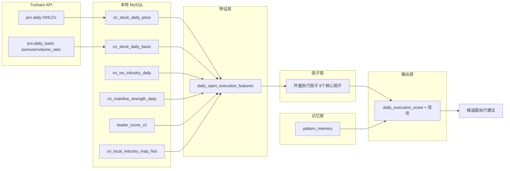

### 7.4 如何避免常见陷阱

#### 7.4.1 避免追在顶部

触发条件：
- daily_execution_score < 30
- 且 gap_risk_score > 60
- 且 reversal_risk > 50

应对：
- 强制输出 AVOID_CHASE
- 即使选股层强烈推荐，执行层也必须拦截

#### 7.4.2 避免情绪高潮接盘

触发条件：
- mainline_lifecycle == 'CONFIRM' 且持续 > 20 天
- 且 leader_concentration > 70%
- 且 volume_ratio_5d > 2.0

应对：
- 降低 mainline_score 权重至 0.5x
- 提高 risk_penalty 至 2x

#### 7.4.3 避免主线退潮误判

触发条件：
- mainline_lifecycle == 'FADE'
- 但个股 ma_status == 'BULLISH'
- 且个股 momentum_20d > 0

应对：
- 不直接 EXIT
- 输出 REDUCE（减仓而非清仓）
- 等待个股趋势确认破坏后再 EXIT

#### 7.4.4 避免龙头末期加仓

触发条件：
- leader_bucket == 'CORE_LEADER'
- 但 mainline_lifecycle == 'FADE'
- 且 momentum_60d > 0.80（累计涨幅过大）

应对：
- 即使评分 > 65，也只输出 HOLD 而非 ADD
- 禁止在龙头末期加仓

---

## 8. 数据流与每日运行流程

### 8.1 数据流图



### 8.2 每日运行流程

每日收盘后（或次日开盘前）执行：

**Step 1: 数据准备 (17:00-18:00)**
- 拉取当日 pro.daily（所有 A 股）
- 拉取当日 pro.daily_basic
- 拉取当日 SW 行业日线
- 写入本地 MySQL

**Step 2: 特征计算 (18:00-18:30)**
- 计算 daily_open_execution_features
  - 开盘缺口特征
  - 量能特征
  - 趋势动量特征
  - 行业特征（关联 SW 行业）
  - 主线特征（关联 cn_mainline_strength_daily）
- 写入 daily_open_execution_features 表

**Step 3: 因子计算 (18:30-19:00)**
- 计算 6 个核心因子
  - gap_risk_score
  - gap_trend_continuation
  - gap_decay_risk
  - gap_recovery_potential
  - volume_breakout_efficiency
  - reversal_risk
- 计算 execution_context_score
- 写入因子结果（可存为视图或临时表）

**Step 4: 记忆更新 (19:00-19:15)**
- 读取今日 forward_1d_return（T+1 回填）
- 更新 pattern_memory 统计
- 计算 confidence_score

**Step 5: 执行评分 (开盘前 09:00-09:15)**
- 读取候选股列表（来自 A-line / B-line）
- 对每只候选股计算 daily_execution_score
- 映射为执行信号
- 输出执行建议表

**Step 6: 结果输出 (09:15)**
- 生成 daily_execution_signal 表
- 输出到交易系统
- 归档日志

### 8.3 增量更新策略

对于历史数据回填：
- 使用 chunk 机制（与现有 cn_mainline_strength_daily 一致）
- 按月分块，支持断点续传
- 回填时同时计算 forward_1d_return 用于记忆系统

对于每日增量：
- 仅处理最新交易日
- 使用 trade_date = (SELECT MAX(trade_date) FROM cn_stock_daily_price)
- 增量更新 pattern_memory

---

## 9. 推荐数据库结构

### 9.1 完整 DDL 清单

| 表名 | 类型 | 用途 | 依赖 |
|------|------|------|------|
| daily_open_execution_features | 事实表 | 存储每日开盘执行特征 | cn_stock_daily_price, cn_stock_daily_basic, cn_sw_industry_daily, cn_mainline_strength_daily |
| pattern_memory | 统计表 | 存储历史模式统计 | daily_open_execution_features |
| daily_execution_signal | 结果表 | 存储每日执行信号 | daily_open_execution_features + 因子计算 |

### 9.2 daily_execution_signal 表

```sql
CREATE TABLE IF NOT EXISTS `daily_execution_signal` (
    `trade_date`    DATE        NOT NULL COMMENT '交易日',
    `symbol`        VARCHAR(10) NOT NULL COMMENT '股票代码',
    `source_system` VARCHAR(16) NOT NULL COMMENT '来源系统: A_LINE / B_LINE',

    -- 评分分量
    `open_strength`         DECIMAL(10,4) DEFAULT NULL COMMENT '开盘强度评分 0-100',
    `mainline_score`        DECIMAL(10,4) DEFAULT NULL COMMENT '主线环境评分 0-100',
    `lifecycle_score`       DECIMAL(10,4) DEFAULT NULL COMMENT '生命周期评分 0-100',
    `momentum_score`        DECIMAL(10,4) DEFAULT NULL COMMENT '动量评分 0-100',
    `memory_score`          DECIMAL(10,4) DEFAULT NULL COMMENT '记忆评分 0-100',
    `risk_penalty`          DECIMAL(10,4) DEFAULT NULL COMMENT '风险惩罚 -50-0',

    -- 核心因子
    `gap_risk_score`                DECIMAL(10,4) DEFAULT NULL,
    `gap_trend_continuation`        DECIMAL(10,4) DEFAULT NULL,
    `gap_decay_risk`                DECIMAL(10,4) DEFAULT NULL,
    `gap_recovery_potential`        DECIMAL(10,4) DEFAULT NULL,
    `volume_breakout_efficiency`    DECIMAL(10,4) DEFAULT NULL,
    `reversal_risk`                 DECIMAL(10,4) DEFAULT NULL,
    `execution_context_score`       DECIMAL(10,4) DEFAULT NULL,

    -- 最终评分与信号
    `daily_execution_score` DECIMAL(10,4) DEFAULT NULL COMMENT '最终执行评分 0-100',
    `execution_signal`      VARCHAR(16)   DEFAULT NULL COMMENT '执行信号',

    -- 元数据
    `created_at` TIMESTAMP NULL DEFAULT CURRENT_TIMESTAMP,

    PRIMARY KEY (`trade_date`, `symbol`, `source_system`),
    KEY `idx_des_signal` (`trade_date`, `execution_signal`),
    KEY `idx_des_score` (`trade_date`, `daily_execution_score` DESC)
) ENGINE=InnoDB DEFAULT CHARSET=utf8mb4 COLLATE=utf8mb4_general_ci;
```

---

## 10. 推荐回测方法

### 10.1 回测框架设计

```python
class DailyExecutionBacktest:
    """
    回测 D_DAILY_OPEN_EXECUTION_LAYER 的执行信号有效性。

    核心问题：
    1. TRY_BUY 信号后，次日/5日后收益是否显著为正？
    2. AVOID_CHASE 信号后，是否避免了亏损？
    3. EXIT 信号后，是否避免了更大回撤？
    """

    def __init__(self, start_date, end_date):
        self.start_date = start_date
        self.end_date = end_date

    def load_data(self):
        """加载 daily_open_execution_features + forward_return"""
        pass

    def compute_signals(self):
        """计算历史每日的执行信号"""
        pass

    def evaluate_signal(self, signal: str):
        """
        评估特定信号的表现：
        - TRY_BUY: 计算 signal -> forward_1d_return 分布
        - AVOID_CHASE: 计算 signal -> 次日是否下跌
        - EXIT: 计算 signal -> 后续 5 日是否继续下跌
        """
        pass

    def confusion_matrix(self):
        """
        构建混淆矩阵：

                        实际涨  实际跌
        建议买             TP     FP
        建议不买/卖        FN     TN

        计算：
        - 准确率
        - 精确率（避免误伤）
        - 召回率（捕捉机会）
        - F1 分数
        """
        pass

    def walk_forward_validation(self, n_splits=5):
        """
        滚动时间序列交叉验证：
        - 按年分割：train 2018-2022, test 2023
        - train 2020-2023, test 2024
        - 检查评分权重在不同年份的稳定性
        """
        pass
```

### 10.2 回测指标

| 指标 | 计算方式 | 含义 |
|------|----------|------|
| 信号准确率 | 正确信号数 / 总信号数 | 信号的整体准确性 |
| 信号精确率 | TP / (TP + FP) | 买入信号中真正上涨的比例 |
| 信号召回率 | TP / (TP + FN) | 上涨股票中被正确识别的比例 |
| 信号 F1 | 2 * P * R / (P + R) | 精确率和召回率的调和平均 |
| 避免亏损率 | AVOID_CHASE 后下跌比例 | 风险信号的保护效果 |
| 信号收益差 | 执行信号 vs 反向信号收益差 | 信号的信息系数 |
| IC（信息系数） | daily_execution_score 与 forward_1d_return 的秩相关 | 评分的预测能力 |

### 10.3 回测注意事项

1. 避免前视偏差：
   - forward_1d_return 必须在 T+1 日收盘后才知道
   - 回测时必须使用 T 日收盘时的数据计算评分
   - 不能使用 T+1 日的数据

2. 样本外验证：
   - 必须保留最近 1 年数据作为样本外
   - 权重优化只能在样本内进行

3. 分组回测：
   - 按评分分组（0-20, 20-40, 40-60, 60-80, 80-100）
   - 检查分组收益是否单调递增
   - 如果分组收益不单调，说明评分结构有问题

4. 特殊时期测试：
   - 牛市（2019-2020）
   - 熊市（2018, 2022）
   - 震荡市（2023-2024）
   - 检查信号在不同市场环境下的稳定性

---

## 11. MVP 最小可落地版本

### 11.1 MVP 范围

MVP 目标：在 2 周内实现可运行的执行过滤层

包含：
- daily_open_execution_features 表 + ETL
- 6 个核心因子（简化版）
- execution_context_score（基础版）
- daily_execution_score + 信号输出
- 每日增量运行脚本

不包含（后续迭代）：
- pattern_memory 系统
- 完整回测框架
- 权重自动优化
- 多系统融合（A-line + B-line）

### 11.2 MVP 实现步骤

| 步骤 | 内容 | 预计工作量 |
|------|------|-----------|
| Step 1 | 创建 daily_open_execution_features 表 DDL | 0.5 天 |
| Step 2 | 实现特征计算 ETL（Python + SQL） | 2 天 |
| Step 3 | 实现 6 个核心因子计算 | 2 天 |
| Step 4 | 实现 execution_context_score | 1 天 |
| Step 5 | 实现 daily_execution_score + 信号映射 | 1 天 |
| Step 6 | 创建 daily_execution_signal 表 + 写入 | 0.5 天 |
| Step 7 | 实现每日增量运行脚本 | 1 天 |
| Step 8 | 历史数据回填（近 3 年） | 1 天 |
| Step 9 | 基础回测验证 | 1 天 |
| 合计 | | 10 天 |

### 11.3 MVP 文件结构

```
data_pipeline/
├── builders/
│   ├── daily_open_execution_features.py    # Step 2: 特征计算
│   ├── daily_execution_factors.py          # Step 3: 因子计算
│   └── daily_execution_scoring.py          # Step 5: 评分+信号
├── common/
│   ├── cli.py                              # 复用现有
│   ├── db.py                               # 复用现有
│   ├── logging_utils.py                    # 复用现有
│   └── state.py                            # 复用现有
└── tushare/
    └── client.py                           # 复用现有

scripts/
├── build_daily_execution_features.py       # Step 2 入口
├── build_daily_execution_factors.py        # Step 3 入口
└── run_daily_execution_pipeline.py         # Step 7: 每日运行

docs/DDL/
├── cn_market.daily_open_execution_features.sql  # Step 1
└── cn_market.daily_execution_signal.sql         # Step 6
```

### 11.4 MVP 简化规则

MVP 阶段，因子权重使用固定值（后续通过回测优化）：

```
daily_execution_score = 
    0.25 * open_strength
    + 0.25 * mainline_score
    + 0.20 * lifecycle_score
    + 0.15 * momentum_score
    + 0.10 * memory_score          # MVP 中固定为 50
    + 0.05 * risk_penalty
```

MVP 阶段，memory_score 固定为 50（中性），待 pattern_memory 系统上线后再启用真实值。

---

## 12. 因子失效分析与优先级

### 12.1 因子失效分析

| 因子 | 最容易失效的场景 | 失效原因 | 应对策略 |
|------|-----------------|----------|----------|
| gap_risk_score | 连续涨停后的高开 | 龙头股高开是加速而非风险 | 加入 leader_bucket 过滤，龙头股降低风险权重 |
| gap_trend_continuation | 主线末期的高开 | 看起来像延续，实际是最后一涨 | 加入 mainline_lifecycle 约束，CONFIRM 末期降低评分 |
| gap_decay_risk | 洗盘日的低开修复 | 低开后快速修复，decay 信号误判 | 加入 volume_ratio 过滤，缩量低开不判定为衰减 |
| gap_recovery_potential | 趋势反转日的低开 | 低开不是洗盘而是趋势结束 | 加入 ma_status 过滤，均线死叉时降低评分 |
| volume_breakout_efficiency | 利好兑现日的放量 | 放量突破是出货而非建仓 | 加入 mainline_lifecycle 过滤，FADE 阶段降低评分 |
| reversal_risk | 主升浪中的正常震荡 | 日内冲高回落是正常换手 | 加入 trend_days 过滤，趋势初期降低风险权重 |

### 12.2 最值得优先实现的模块

| 优先级 | 模块 | 理由 |
|--------|------|------|
| P0 | daily_open_execution_features ETL | 所有因子的数据基础 |
| P0 | gap_risk_score + gap_trend_continuation | 最核心的两个开盘判断因子 |
| P0 | execution_context_score | 主线环境融合的核心 |
| P1 | reversal_risk | 冲高回落是 A 股最常见的陷阱 |
| P1 | daily_execution_score + 信号映射 | 最终输出 |
| P2 | gap_recovery_potential | 低开判断，辅助因子 |
| P2 | volume_breakout_efficiency | 放量判断，辅助因子 |
| P3 | pattern_memory 系统 | 需要足够历史数据支撑 |
| P3 | 权重自动优化 | 需要回测框架支撑 |

### 12.3 长期维护建议

1. 季度权重校准：
   - 每季度检查因子 IC 是否衰减
   - 如果某个因子 IC 连续 3 个月为负，降低权重或移除

2. 年度模型重建：
   - 每年使用最新 3 年数据重建评分模型
   - 检查市场结构变化（如注册制、涨跌幅限制变化）

3. 新因子准入标准：
   - 样本外 IC > 0.03
   - 分组收益单调
   - 与现有因子相关性 < 0.6
   - 有明确的 A 股行为学逻辑

4. 监控指标：
   - 每日信号分布（是否过于集中或分散）
   - 信号与实际收益的相关性（滚动 20 日 IC）
   - 各因子贡献度变化

---

## 附录 A：与现有系统的集成点

### A.1 数据依赖

| 现有表/视图 | 用途 | 集成方式 |
|------------|------|----------|
| cn_stock_daily_price | OHLCV 数据 | SQL JOIN |
| cn_stock_daily_basic | turnover_rate, volume_ratio | SQL JOIN |
| cn_sw_industry_daily | 行业日线 | SQL JOIN |
| cn_mainline_strength_daily | 主线强度 + 生命周期 | SQL JOIN |
| leader_score_v2 | 龙头评分 | SQL JOIN |
| cn_local_industry_map_hist | 股票-行业映射 | SQL JOIN |

### A.2 代码复用

| 现有模块 | 复用方式 |
|----------|----------|
| data_pipeline/common/db.py | 直接复用数据库连接 |
| data_pipeline/common/cli.py | 直接复用 CLI 参数解析 |
| data_pipeline/common/state.py | 直接复用状态管理 |
| data_pipeline/common/logging_utils.py | 直接复用日志 |
| data_pipeline/tushare/client.py | 直接复用 Tushare 客户端 |

### A.3 运行集成

每日运行顺序：

1. sync_cn_stock_daily_price_from_tushare.py  (现有)
2. sync_cn_stock_daily_basic_from_tushare.py  (现有)
3. sync_cn_sw_industry_daily_from_tushare.py  (现有)
4. build_industry_capital_flow.py              (现有)
5. build_cn_mainline_strength_daily.py            (现有)
6. build_daily_execution_features.py           (新增)
7. build_daily_execution_factors.py            (新增)
8. run_daily_execution_pipeline.py             (新增)

---

## 附录 B：关键风险与缓解

| 风险 | 影响 | 缓解措施 |
|------|------|----------|
| Tushare API 限流 | 数据获取延迟 | 使用本地缓存 + 增量更新 |
| 因子在极端行情失效 | 信号质量下降 | 加入 market_regime 过滤 |
| 过拟合到历史模式 | 样本外表现差 | 滚动验证 + 最小样本量约束 |
| 主线切换频繁 | 信号不稳定 | 使用移动平均平滑主线状态 |
| 新股/次新股数据不足 | 特征计算不完整 | 设置最小交易天数过滤（>60天） |
