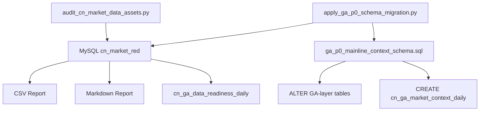
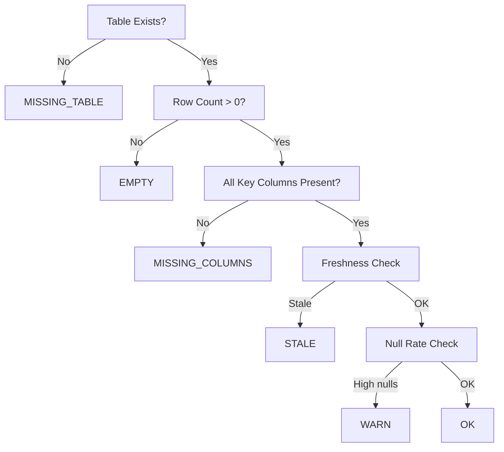
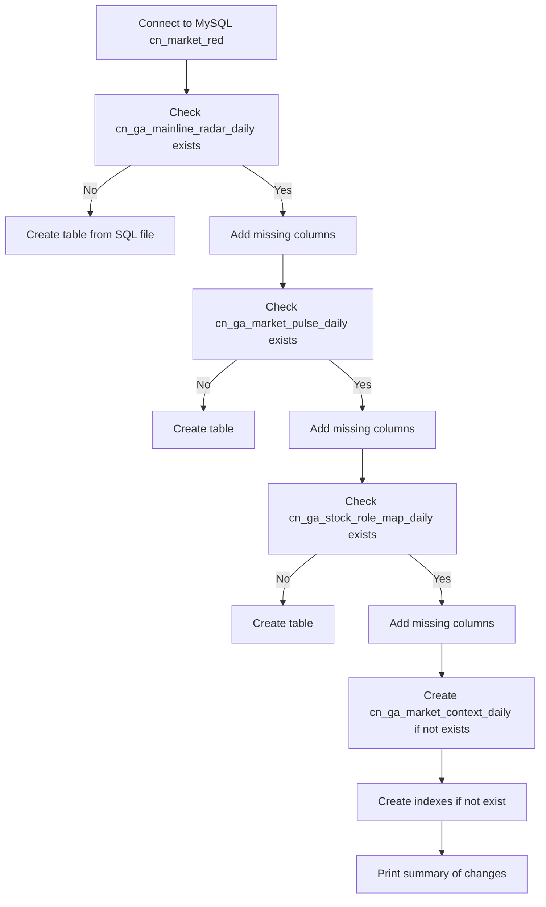

# P0_DATA_AUDIT_AND_DDL_DESIGN — Implementation Plan

## Overview

This plan covers the complete implementation of a data asset audit system and DDL migration for the `cn_market_red` database (logical name `cn_market`), targeting the GrowthAlpha V8 Mainline Strength Engine, Market Breadth Engine, and Narrative/Context Layer readiness assessment.

> **Database Note**: The actual runtime database is `cn_market_red` (default from `ASHARE_MYSQL_DB` env var in [`app/settings.py`](app/settings.py:14)). The DDL files use `cn_market` as the logical name — the [`load_sql_for_current_db()`](app/settings.py:17) function substitutes `cn_market` → `cn_market_red` at runtime. The audit script and migration script accept `--db-name` (default `cn_market_red`).

---

## Architecture Overview



---

## Deliverable Files

| # | File | Type | Description |
|---|------|------|-------------|
| 1 | [`scripts/audit_cn_market_data_assets.py`](scripts/audit_cn_market_data_assets.py) | Python | Data asset audit script |
| 2 | [`scripts/apply_ga_p0_schema_migration.py`](scripts/apply_ga_p0_schema_migration.py) | Python | Schema migration script |
| 3 | [`sql/ddl/ga_p0_mainline_context_schema.sql`](sql/ddl/ga_p0_mainline_context_schema.sql) | SQL | DDL for GA-layer extensions |
| 4 | [`docs/P0_DATA_AUDIT_AND_DDL_DESIGN.md`](docs/P0_DATA_AUDIT_AND_DDL_DESIGN.md) | Markdown | Audit report template + documentation |

---

## Task 1: Audit Script — [`scripts/audit_cn_market_data_assets.py`](scripts/audit_cn_market_data_assets.py)

### CLI Arguments

| Argument | Default | Description |
|----------|---------|-------------|
| `--db-host` | `127.0.0.1` | MySQL host |
| `--db-port` | `3306` | MySQL port |
| `--db-user` | `root` | MySQL user |
| `--db-password` | (required) | MySQL password |
| `--db-name` | `cn_market_red` | Database name (actual runtime name) |
| `--output-dir` | `reports/data_audit` | Output directory for reports |
| `--as-of-date` | today | Reference date for freshness checks |
| `--write-db` | flag | Write results to `cn_ga_data_readiness_daily` |
| `--fail-on-critical` | flag | Exit code 1 if P0 tables fail |

### Table Audit Registry

The script defines a registry of all 20+ tables with their metadata:

```python
TABLE_REGISTRY = [
    # (table_name, tier, expected_columns, freshness_threshold_days, date_column)
    
    # P0_CRITICAL
    ("cn_stock_daily_price", "P0_CRITICAL", 
     ["SYMBOL","TRADE_DATE","OPEN","HIGH","LOW","CLOSE","VOLUME","AMOUNT","CHG_PCT"], 5, "TRADE_DATE"),
    ("cn_index_daily_price", "P0_CRITICAL",
     ["INDEX_CODE","TRADE_DATE","OPEN","CLOSE","HIGH","LOW","VOLUME","AMOUNT","PRE_CLOSE","CHG_PCT"], 5, "TRADE_DATE"),
    ("cn_sw_industry_daily", "P0_CRITICAL",
     ["ts_code","name","trade_date","close","amount"], 5, "trade_date"),
    ("cn_stock_monthly_basic", "P0_CRITICAL",
     ["symbol","trade_date","month_key","total_mv","circ_mv","pe_ttm","pb"], 45, "trade_date"),
    ("cn_stock_fina_indicator", "P0_CRITICAL",
     ["symbol","end_date","ann_date","report_type","netprofit_yoy","q_profit_yoy","or_yoy","eps","roe","grossprofit_margin"], 90, "end_date"),
    
    # P1_IMPORTANT
    ("cn_stock_daily_basic", "P1_IMPORTANT",
     ["symbol","trade_date","pe_ttm","pb","total_mv","circ_mv","volume_ratio"], 5, "trade_date"),
    ("cn_stock_leader_score_daily", "P1_IMPORTANT",
     ["trade_date","symbol","leader_score","leader_bucket"], 5, "trade_date"),
    ("cn_stock_leader_sw_l1_latest_snap", "P1_IMPORTANT",
     ["trade_date","symbol","leader_score","sw_l1_id"], 5, "trade_date"),
    ("cn_stock_universe_status_t", "P1_IMPORTANT",
     ["symbol","is_active","last_trade_date"], None, "last_trade_date"),
    
    # P2_STRUCTURE
    ("cn_board_member_map_d", "P2_STRUCTURE",
     ["trade_date","sector_type","sector_id","symbol"], 7, "trade_date"),
    ("cn_local_industry_map_hist", "P2_STRUCTURE",
     ["symbol","industry_id","in_date","out_date","is_current"], None, "in_date"),
    ("cn_local_industry_proxy_daily", "P2_STRUCTURE",
     ["industry_id","trade_date","member_count","ret_eqw","amount_total"], 5, "trade_date"),
    
    # P3_REPORTING
    ("cn_stock_income", "P3_REPORTING",
     ["symbol","end_date","ann_date","report_type","total_revenue","n_income_attr_p"], None, "end_date"),
    ("cn_stock_balancesheet", "P3_REPORTING",
     ["symbol","end_date","ann_date","report_type","total_assets","total_liab"], None, "end_date"),
    ("cn_event_disclosure_date", "P3_REPORTING",
     ["symbol","end_date","pre_date","actual_date"], None, "end_date"),
    ("cn_event_earnings_forecast", "P3_REPORTING",
     ["symbol","ann_date","end_date","forecast_type","p_change_min","p_change_max"], None, "ann_date"),
    
    # GA_LAYER
    ("cn_ga_mainline_radar_daily", "GA_LAYER",
     ["trade_date","mainline_id","mainline_name","member_count","leader_count","mainline_score","mainline_state","rank_no","reason"], 5, "trade_date"),
    ("cn_ga_market_pulse_daily", "GA_LAYER",
     ["trade_date","market_score","market_state","target_exposure","breadth_up_ratio","risk_flag","reason"], 5, "trade_date"),
    ("cn_ga_stock_role_map_daily", "GA_LAYER",
     ["trade_date","symbol","stock_name","mainline_id","mainline_name","leader_score","stock_role","role_score","role_reason"], 5, "trade_date"),
    ("cn_ga_data_readiness_daily", "GA_LAYER",
     ["trade_date","table_name","status","severity","row_count","max_trade_date","null_rate_summary"], None, "trade_date"),
]
```

### Date Column Auto-Detection

Priority order for date column detection:

1. `trade_date` → `TRADE_DATE` → `ann_date` → `ANN_DATE` → `end_date` → `END_DATE` → `date` → `DATE` → `created_at` → `CREATED_AT`

The script queries `INFORMATION_SCHEMA.COLUMNS` to find which date column actually exists, then uses the first match.

### Audit Logic Per Table

```python
def audit_table(conn, table_def, as_of_date):
    # 1. Check table exists via INFORMATION_SCHEMA.TABLES
    # 2. If not exists → MISSING_TABLE
    # 3. Get row count
    # 4. Get min/max date from detected date column
    # 5. Get distinct trade days count
    # 6. Check expected columns via INFORMATION_SCHEMA.COLUMNS
    # 7. Compute null rates for key columns
    # 8. Compute latest_lag_days = (as_of_date - max_date).days
    # 9. Determine status based on tier + thresholds
    # 10. Determine severity
    # 11. Generate recommendation text
```

### Status Determination Logic



### Output Files

1. **CSV**: `reports/data_audit/data_asset_audit_<YYYYMMDD_HHMMSS>.csv`
   - Columns: `table_name, tier, exists_flag, object_type, row_count, min_trade_date, max_trade_date, distinct_trade_days, expected_key_columns, missing_key_columns, latest_lag_days, null_rate_summary, status, severity, recommendation`

2. **Markdown**: `reports/data_audit/data_asset_audit_<YYYYMMDD_HHMMSS>.md`
   - Full report with Executive Summary, Critical Table Status, Date Coverage, Missing Columns, Stale Tables, Recommendations

3. **Latest**: `reports/data_audit/data_asset_audit_latest.md`
   - Copy of the latest report

### Write to `cn_ga_data_readiness_daily`

When `--write-db` is enabled, for each table audit result:

```sql
INSERT INTO cn_ga_data_readiness_daily 
    (trade_date, table_name, status, severity, row_count, 
     max_trade_date, null_rate_summary, recommendation)
VALUES (...)
ON DUPLICATE KEY UPDATE
    status=VALUES(status), severity=VALUES(severity),
    row_count=VALUES(row_count), max_trade_date=VALUES(max_trade_date),
    null_rate_summary=VALUES(null_rate_summary),
    recommendation=VALUES(recommendation);
```

### Readiness Assessment

At the end of the report, the script answers:

1. **Ready for Mainline Strength Engine?**
   - Requires: `cn_stock_daily_price` OK, `cn_board_member_map_d` OK, `cn_local_industry_map_hist` OK, `cn_local_industry_proxy_daily` OK, `cn_ga_mainline_radar_daily` OK

2. **Ready for Market Breadth Engine?**
   - Requires: `cn_stock_daily_price` OK, `cn_index_daily_price` OK, `cn_sw_industry_daily` OK, `cn_ga_market_pulse_daily` OK

3. **Ready for Narrative/Context Layer?**
   - Requires: `cn_ga_mainline_radar_daily` OK, `cn_ga_market_pulse_daily` OK, `cn_ga_stock_role_map_daily` OK, `cn_stock_fina_indicator` OK

---

## Task 2: DDL SQL — [`sql/ddl/ga_p0_mainline_context_schema.sql`](sql/ddl/ga_p0_mainline_context_schema.sql)

### Compatibility Strategy

Since MySQL 8.0 does NOT support `ADD COLUMN IF NOT EXISTS` natively (that's a MariaDB feature), the SQL file will contain:

1. `CREATE TABLE IF NOT EXISTS cn_ga_market_context_daily` (safe, standard MySQL)
2. Column additions are **delegated to the Python migration script** which checks `INFORMATION_SCHEMA.COLUMNS` first
3. Index creation uses `CREATE INDEX` with `IF NOT EXISTS` commented — the Python script handles idempotency

### `cn_ga_market_context_daily` Table

```sql
CREATE TABLE IF NOT EXISTS `cn_ga_market_context_daily` (
    `trade_date` DATE NOT NULL,
    `market_regime` VARCHAR(64) DEFAULT NULL,
    `mainline_phase` VARCHAR(64) DEFAULT NULL,
    `rotation_state` VARCHAR(64) DEFAULT NULL,
    `trend_confidence_score` DECIMAL(10,4) DEFAULT NULL,
    `risk_context` VARCHAR(128) DEFAULT NULL,
    `narrative_summary` TEXT DEFAULT NULL,
    `data_quality_status` VARCHAR(32) DEFAULT NULL,
    `created_at` TIMESTAMP NULL DEFAULT CURRENT_TIMESTAMP,
    `updated_at` TIMESTAMP NULL DEFAULT CURRENT_TIMESTAMP ON UPDATE CURRENT_TIMESTAMP,
    PRIMARY KEY (`trade_date`),
    KEY `idx_ga_market_context_daily_regime` (`market_regime`),
    KEY `idx_ga_market_context_daily_phase` (`mainline_phase`),
    KEY `idx_ga_market_context_daily_rotation` (`rotation_state`)
) ENGINE=InnoDB DEFAULT CHARSET=utf8mb4 COLLATE=utf8mb4_unicode_ci;
```

### Indexes for GA Tables

```sql
-- cn_ga_mainline_radar_daily indexes
CREATE INDEX IF NOT EXISTS idx_ga_mainline_radar_daily_date ON cn_ga_mainline_radar_daily (trade_date);
CREATE INDEX IF NOT EXISTS idx_ga_mainline_radar_daily_mainline ON cn_ga_mainline_radar_daily (mainline_id, trade_date);
CREATE INDEX IF NOT EXISTS idx_ga_mainline_radar_daily_state ON cn_ga_mainline_radar_daily (mainline_state, trade_date);

-- cn_ga_market_pulse_daily indexes
CREATE INDEX IF NOT EXISTS idx_ga_market_pulse_daily_date ON cn_ga_market_pulse_daily (trade_date);
CREATE INDEX IF NOT EXISTS idx_ga_market_pulse_daily_state ON cn_ga_market_pulse_daily (market_state, trade_date);

-- cn_ga_stock_role_map_daily indexes
CREATE INDEX IF NOT EXISTS idx_ga_stock_role_map_daily_date ON cn_ga_stock_role_map_daily (trade_date);
CREATE INDEX IF NOT EXISTS idx_ga_stock_role_map_daily_symbol ON cn_ga_stock_role_map_daily (symbol, trade_date);
CREATE INDEX IF NOT EXISTS idx_ga_stock_role_map_daily_role ON cn_ga_stock_role_map_daily (stock_role, trade_date);
CREATE INDEX IF NOT EXISTS idx_ga_stock_role_map_daily_mainline ON cn_ga_stock_role_map_daily (mainline_id, trade_date);
```

---

## Task 3: Migration Script — [`scripts/apply_ga_p0_schema_migration.py`](scripts/apply_ga_p0_schema_migration.py)

### CLI Arguments

| Argument | Default | Description |
|----------|---------|-------------|
| `--db-host` | `127.0.0.1` | MySQL host |
| `--db-port` | `3306` | MySQL port |
| `--db-user` | `root` | MySQL user |
| `--db-password` | (required) | MySQL password |
| `--db-name` | `cn_market_red` | Database name |

### Migration Logic

```python
def column_exists(conn, table, column):
    """Check if a column exists in a table."""
    sql = """
        SELECT COUNT(*) as cnt 
        FROM INFORMATION_SCHEMA.COLUMNS 
        WHERE TABLE_SCHEMA = :schema 
          AND TABLE_NAME = :table 
          AND COLUMN_NAME = :column
    """
    result = conn.execute(text(sql), {"schema": db_name, "table": table, "column": column}).scalar()
    return result > 0

def add_column_if_not_exists(conn, table, column_def):
    """Add column only if it doesn't exist."""
    col_name = column_def.split()[0]  # Extract column name
    if not column_exists(conn, table, col_name):
        alter_sql = f"ALTER TABLE {table} ADD COLUMN {column_def}"
        conn.execute(text(alter_sql))
        return True
    return False
```

### Columns to Add

**`cn_ga_mainline_radar_daily`** additions:

| Column | Type | Default |
|--------|------|---------|
| `rs_60d` | `DECIMAL(10,4)` | NULL |
| `rs_120d` | `DECIMAL(10,4)` | NULL |
| `trend_alignment_score` | `DECIMAL(10,4)` | NULL |
| `rotation_rank` | `INT` | NULL |
| `heat_percentile_5d` | `DECIMAL(10,4)` | NULL |
| `breakout_ratio` | `DECIMAL(10,4)` | NULL |
| `new_high_ratio` | `DECIMAL(10,4)` | NULL |
| `strong_stock_count` | `INT` | NULL |
| `leader_density` | `DECIMAL(10,4)` | NULL |
| `mainline_phase` | `VARCHAR(32)` | NULL |
| `mainline_confidence` | `DECIMAL(10,4)` | NULL |

**`cn_ga_market_pulse_daily`** additions:

| Column | Type | Default |
|--------|------|---------|
| `bullish_industry_ratio` | `DECIMAL(10,4)` | NULL |
| `neutral_industry_ratio` | `DECIMAL(10,4)` | NULL |
| `bearish_industry_ratio` | `DECIMAL(10,4)` | NULL |
| `rotation_speed` | `DECIMAL(10,4)` | NULL |
| `mainline_stability` | `DECIMAL(10,4)` | NULL |
| `trend_alignment_avg` | `DECIMAL(10,4)` | NULL |
| `industry_expansion_breadth` | `DECIMAL(10,4)` | NULL |
| `top_mainline_count` | `INT` | NULL |
| `market_phase` | `VARCHAR(32)` | NULL |

**`cn_ga_stock_role_map_daily`** additions:

| Column | Type | Default |
|--------|------|---------|
| `breakout_strength` | `DECIMAL(10,4)` | NULL |
| `new_high_flag` | `TINYINT(1)` | NULL |
| `trend_structure_score` | `DECIMAL(10,4)` | NULL |
| `volume_expansion_score` | `DECIMAL(10,4)` | NULL |
| `role_lifecycle_state` | `VARCHAR(32)` | NULL |
| `candidate_action` | `VARCHAR(64)` | NULL |

### Migration Sequence



### Idempotency

The script is designed to be run multiple times safely:
- `column_exists()` check prevents duplicate column additions
- `CREATE TABLE IF NOT EXISTS` prevents table creation errors
- Index creation uses `try/except` to handle "already exists" errors
- No data is dropped or modified

---

## Task 4: Report Template — [`docs/P0_DATA_AUDIT_AND_DDL_DESIGN.md`](docs/P0_DATA_AUDIT_AND_DDL_DESIGN.md)

This file serves as both documentation and the audit report template. It contains:

1. **Executive Summary** — Overall data health status
2. **Critical Table Status** — Per-table status matrix
3. **Date Coverage Summary** — Min/max dates per table
4. **Missing Columns** — Tables with missing key columns
5. **Stale Tables** — Tables exceeding freshness thresholds
6. **Null Rate Analysis** — Key fields with high null rates
7. **Recommended Next Actions** — Prioritized action items
8. **Readiness Assessment** — For Mainline Strength Engine, Market Breadth Engine, Narrative Layer

---

## Task 5: Syntax Verification

After implementation, run:

```bash
python -m py_compile scripts/audit_cn_market_data_assets.py
python -m py_compile scripts/apply_ga_p0_schema_migration.py
```

Both must pass without errors.

---

## Task 6: Final Delivery

Package into a zip file containing only:

```
scripts/audit_cn_market_data_assets.py
scripts/apply_ga_p0_schema_migration.py
sql/ddl/ga_p0_mainline_context_schema.sql
docs/P0_DATA_AUDIT_AND_DDL_DESIGN.md
```

---

## Implementation Order

| Step | File | Description |
|------|------|-------------|
| 1 | [`scripts/audit_cn_market_data_assets.py`](scripts/audit_cn_market_data_assets.py) | Main audit script with all 20+ tables |
| 2 | [`sql/ddl/ga_p0_mainline_context_schema.sql`](sql/ddl/ga_p0_mainline_context_schema.sql) | DDL for new table + indexes |
| 3 | [`scripts/apply_ga_p0_schema_migration.py`](scripts/apply_ga_p0_schema_migration.py) | Migration script with column checks |
| 4 | [`docs/P0_DATA_AUDIT_AND_DDL_DESIGN.md`](docs/P0_DATA_AUDIT_AND_DDL_DESIGN.md) | Documentation + report template |
| 5 | Syntax check | `py_compile` both Python files |
| 6 | Zip packaging | Final deliverable |

---

## Key Design Decisions

1. **Database name**: Default is `cn_market_red` (matching [`app/settings.py`](app/settings.py:14) default). The `--db-name` parameter allows overriding.

2. **Date column auto-detection** — Uses `INFORMATION_SCHEMA.COLUMNS` to find the correct date column per table, since not all tables use `trade_date`. Some use `TRADE_DATE`, `end_date`, `ann_date`, etc.

3. **Column existence check via INFORMATION_SCHEMA** — Since MySQL 8 doesn't support `ADD COLUMN IF NOT EXISTS`, the Python migration script checks `INFORMATION_SCHEMA.COLUMNS` before each ALTER.

4. **Tier-based severity** — P0 tables use strict FAIL/STALE rules; P1 uses WARN; P2/P3/GA use WARN/INFO to avoid false positives.

5. **Readiness assessment** — Three separate boolean assessments at the end of the report, not a single pass/fail.

6. **CSV + Markdown dual output** — CSV for programmatic consumption, Markdown for human readability.

7. **SQL file naming**: Uses `sql/ddl/` directory (consistent with [`docs/DDL/`](docs/DDL/) convention but in the standard `sql/` path for executable DDL).
